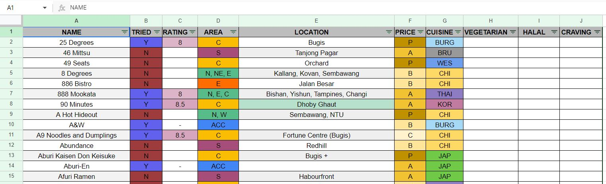
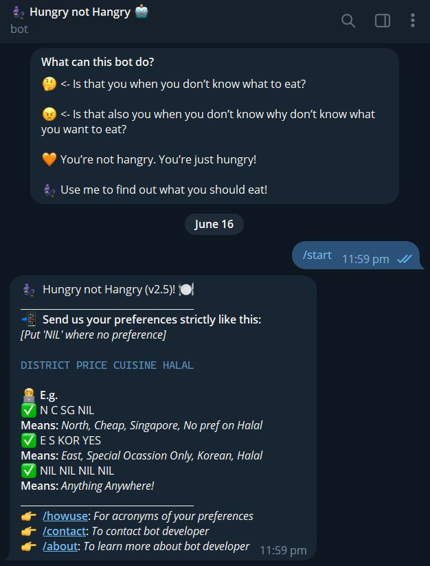
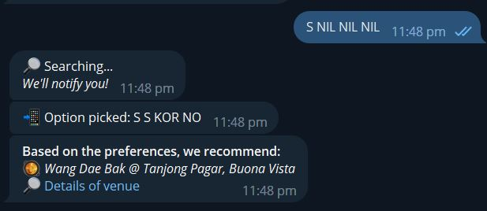

# Hungry-not-Hangry
<h2> Personal Project Description </h2>

This project was initiated to address the problem of people's indecisiveness when it comes to choosing where and what to eat. Often, we are overwhelmed by the possible foods to choose from and the places to eat at, leading to an unproportional ratio in time spent choosing where to eat and actually eating. As such, instead of putting so much time and effort to thinking of what/where to eat, why not let a Telegram chatbot randomly choose a place and restaurant for you, based off your preferences! That way, you can allocate the justified amount of effort to enjoying the food in front of you.

This project make use of Telegram bot, Google Sheets to hold the data of the food places, and Google Apps Script to host the algorithmic program of the Telegram bot.

Have a watch a the project video: <a href="https://youtu.be/tFazR2Bgmj8">Click here</a>

<h2>Google Sheets in this project</h2>
Google Sheets was essentially the database of this project. It contained data shown in the following in image:
</img>
<b>The important columns are: </b> 
<i>(User's preferences: Provided by user and searched through the Sheets)</i> 
AREA, PRICE, CUISINE, HALAL   

<i>(Results: Sent back to the user by the Telebot)</i> 
NAME, LOCATION  

<h2>Use-case</h2>
<h3>The following images are an example of the Telebot coming together with the Google Sheet.</h3> 
 First image: Telebot providing instructions on how to use it.
</img> 
 Second image: Using of Telebot.
</img>

<h3>Example Explanation:</h3>
In our example shown in image 2, the user gave their preference of "S NIL NIL NIL". In "english-form", the given input would translate to:  
<i>The user wants a food venue for a place in the <b>South and has not preferences in price, cuisine and halal.</b></i>  

<b>For more examples, watch the project video provided on top.</b>

